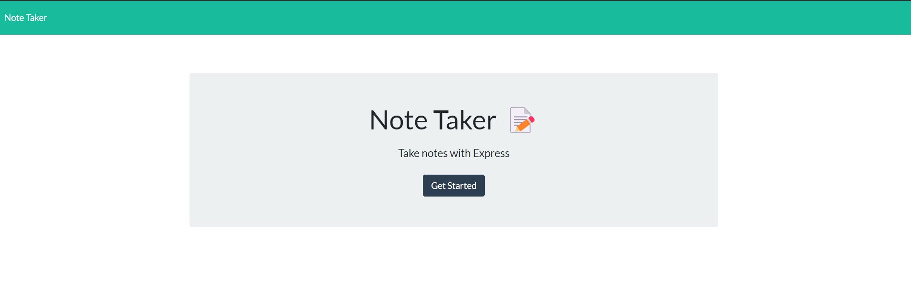

# Take Note

A full stack application to keep your notes organized. 

## Table of Contents
* [Installation](#installation)
* [Usage](#usage)
* [Contributing](#contributing)
* [Questions](#questions)

## Installation
You will need the following libraries:
* express
* fs
* path

## Usage
Install what's needed and press npm start! 

## Contributing
Made by Taylor Vaughn

## Questions
If you have any questions, contact me at troat9824@gmail.com

## Deployed Site
https://guarded-forest-17560.herokuapp.com/